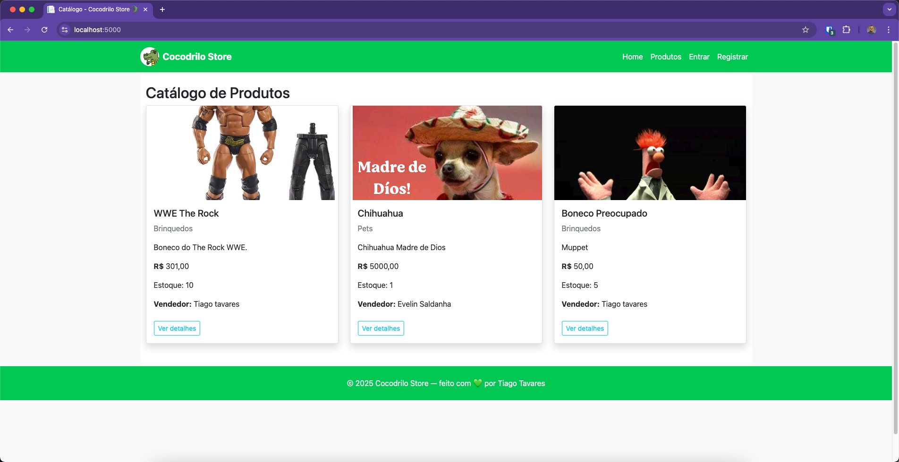
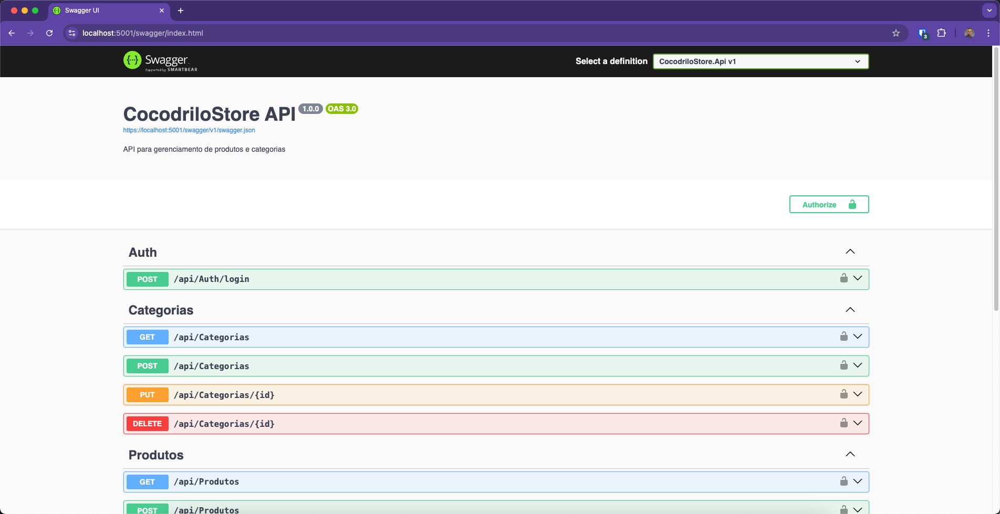

# **Cocodrilo Store - Aplicação de E-Commerce com MVC e API RESTful**

## **1. Apresentação**

Bem-vindo ao repositório do projeto **Cocodrilo Store**. Este projeto é uma entrega do MBA DevXpert Full Stack .NET e é referente ao módulo **Introdução ao Desenvolvimento ASP.NET Core**.
O objetivo principal desenvolver uma aplicação de e-commerce que permite aos usuários criar, editar, visualizar e excluir produtos e categorias, tanto através de uma interface web utilizando MVC quanto através de uma API RESTful.

### **Autor(es)**

- Tiago da Silva Tavares

## **2. Proposta do Projeto**

O projeto consiste em:

- **Aplicação MVC:** Interface web para interação com o e-commerce.
- **API RESTful:** Exposição dos recursos do e-commerce para integração com outras aplicações ou desenvolvimento de front-ends alternativos.
- **Autenticação e Autorização:** Implementação de controle de acesso, diferenciando para os vendedores.
- **Acesso a Dados:** Implementação de acesso ao banco de dados através de ORM.

## **3. Tecnologias Utilizadas**

- **Linguagem de Programação:** C#
- **Frameworks:**
    - ASP.NET Core MVC
    - ASP.NET Core Web API
    - Entity Framework Core
- **Banco de Dados:** SQLite e SQL Server
- **Autenticação e Autorização:**
    - ASP.NET Core Identity
    - JWT (JSON Web Token) para autenticação na API
- **Front-end:**
    - Razor Pages/Views
    - HTML/CSS para estilização básica
- **Documentação da API:** Swagger com autenticação por Bearer Token

## **4. Estrutura do Projeto**

A estrutura do projeto é organizada da seguinte forma:

- src/
    - CocodriloStore.Web/ - Projeto MVC
    - CocodriloStore.Api/ - API RESTful
- README.md - Arquivo de Documentação do Projeto
- FEEDBACK.md - Arquivo para Consolidação dos Feedbacks
- .gitignore - Arquivo de Ignoração do Git

## **5. Funcionalidades Implementadas**

- **CRUD para Produtos e Categorias:** Permite criar, editar, visualizar e excluir produtos e categorias.
- **Autenticação e Autorização:** Diferenciação entre usuários anônimos e vendedores.
- **API RESTful:** Exposição de endpoints para operações CRUD via API.
- **Documentação da API:** Documentação automática dos endpoints da API utilizando Swagger.

## **6. Como Executar o Projeto**

### **Pré-requisitos**

- .NET SDK 8.0 ou superior
- SQL Server
- Visual Studio 2022 ou superior (ou qualquer IDE de sua preferência)
- Git

### **Passos para Execução**

1. **Clone o Repositório:**
    - `git clone https://github.com/0xtiago/cocodrilo-store`
    - `cd cocodrilo-store`
2. **Configuração do Banco de Dados:**
    - ~~No arquivo `appsettings.json`, configure a string de conexão do SQL Server.~~
    - ~~Rode o projeto para que a configuração do Seed crie o banco e popule com os dados básicos~~
3. **Executar a Aplicação MVC:**
    - `cd src/CocodriloStore.Mvc/`
    - `dotnet run`
    - Acesse a aplicação em: http://localhost:5000
4. **Executar a API:**
    - `cd src/CocodriloStore.Api/`
    - `dotnet run`
    - Acesse a documentação da API em: http://localhost:5001/swagger
5. **Executar e parar tudo de forma automática**:
    - `chmod +x start-cocodrilo.sh ; ./start-cocodrilo.sh`
    - `chmod +x stop-cocodrilo.sh ; ./stop-cocodrilo.sh`

## **7. Instruções de Configuração**

- **JWT para API:** As chaves de configuração do JWT estão no `appsettings.Development.json`.
- ~~**Migrações do Banco de Dados:** As migrações são gerenciadas pelo Entity Framework Core. Não é necessário aplicar devido a configuração do Seed de dados.~~

## **8. Documentação da API**

A documentação da API está disponível através do Swagger. Após iniciar a API, acesse a documentação em:

http://localhost:5001/swagger

## **9. Avaliação**

- Este projeto é parte de um curso acadêmico e não aceita contribuições externas.
- Para feedbacks ou dúvidas utilize o recurso de Issues
- O arquivo `FEEDBACK.md` é um resumo das avaliações do instrutor e deverá ser modificado apenas por ele.